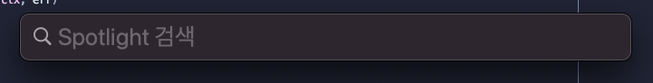
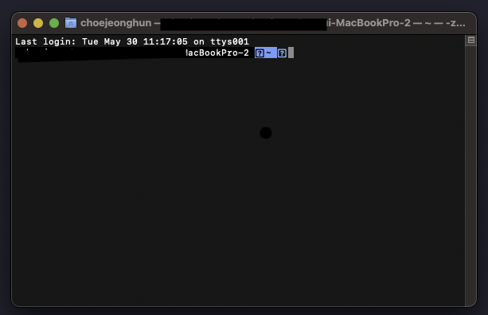
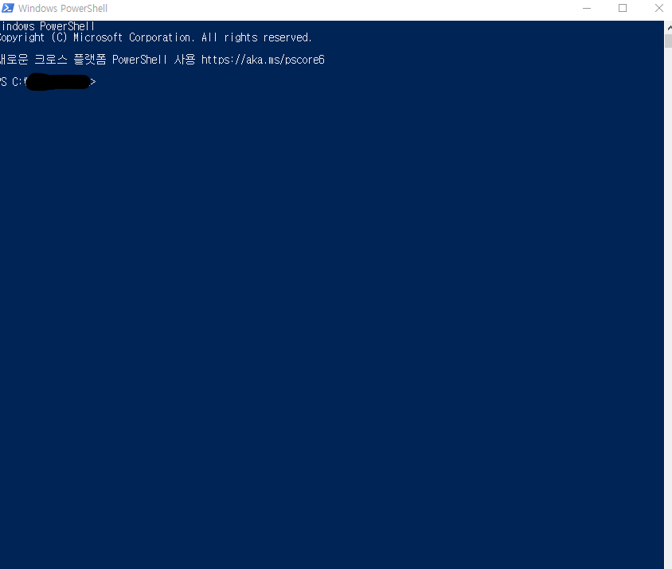
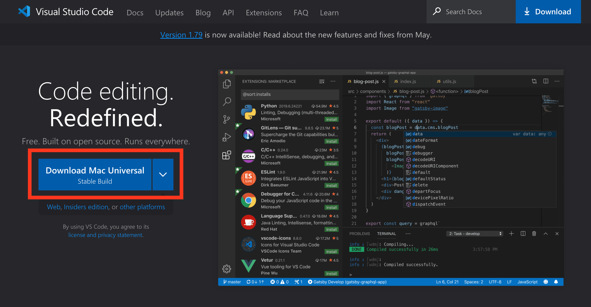
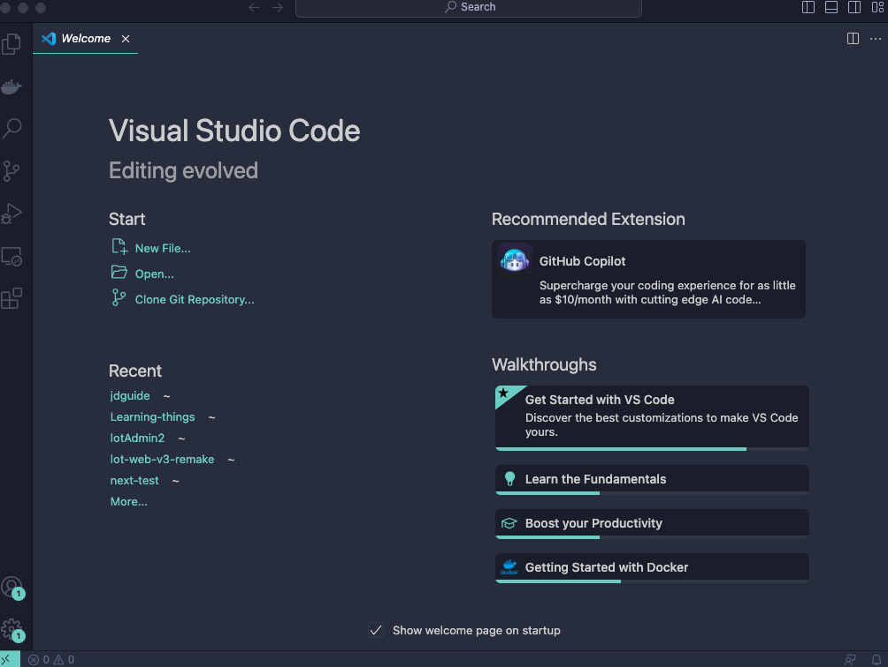

# [vuepress] 1-2. 웹 페이지를 만들기 어렵지 않아요. 기본 세팅부터 천천히

이 장에서는 우리가 웹 블로그를 만들때 필요한 최소한의 준비물을 알려드리겠습니다.

## 웹 페이지를 만들때 쓰는 도구

우리는 블로그의 형식을 띄는 웹 페이지를 만들려고 합니다. 이런 웹 페이지를 만들때는 어쩔수 없이 코드(`Code`)를 만지고 접할 수 밖에 없습니다. 다만 직접적인 수정을 하실 필요가 없도록 제공하는 템플릿이 있을 것 입니다. 다만 설치하고 작동하는 법은 알아야하기 때문에 가장 기본이 되는 것은 알려 드릴 예정입니다.

웹 페이지를 제작하기 위한 최소 도구

1. 컴퓨터
2. 콘솔 도구
3. 코드 에디터

이제 부터 기본 준비물들이 왜 필요하고 환경에 따라 어떻게 셋팅하면 좋을지 알려드리겠습니다.
::: warning
아래 내용을 보면서 화면이 조금 다르게 생겼다고 틀린게 아닙니다. 너무 걱정하지 마시고 따라 오세요
:::

### 컴퓨터

진짜 아무 컴퓨터나 다 괜찮습니다. 하지만 개발은 개발환경에 따라 어디서는 버그가 발생할 수도 아닐수도 있습니다. 개발환경을 같은 환경으로 만드는 것이 생각보다 중요합니다.
::: warning
**똑같이 했는데 나는 왜 안 되는거지 할때 대부분 작은 것을 놓쳤거나 환경을 잘못 셋팅한 경우가 왕왕 있습니다.**
:::

앞으로 가이드는 MAC 과 Window 에서 활용할 수 있도록 가이드 할 예정입니다. 최대한 따라해 보시고 이해가 어렵거나 에러를 만나셨다면 댓글로 알려주세요 가이드 하도록 하겠습니다.

### 콘솔 도구

::: details MAC
MAC 에는 자체적인 콘솔 도구가 있습니다. terminal 이라고 불리는 것인데요. `command` + `space` 를 동시에 입력하면 `spotlight`이 보입니다.

이제 `terminal`을 검색하세요 그럼 옛날 도스 컴퓨터에서 보던 검은색 창이 나타날 겁니다.

이제 콘솔 도구까지 준비 되었습니다. 다음 단계로 넘어 가겠습니다.
:::

::: details Window
Window 에서는 `PowerShell`을 사용할 것 입니다. 찾기에서 `PowerShell`이라고 검색하면 쉽게 찾아 볼 수 있습니다.

그럼 다음과 같은 창을 볼 수 있을겁니다

:::

### 코드 에디터

우리는 코드 에디터를 통해서 코드를 확인하고 작성할 수 있어야합니다.(필요하다면요) 물론 메모장에서도 코드를 보고 수정하고 할 수 있습니다. 코드도 그저 문자 쪼가리일 뿐이니까요. 하지만 메모장에서 코드를 수정하는 일은 정말로 어려울거에요. 마치 의자를 나무랑 못만 주고 만들라고 하는 것과 같아요. 우리에게는 망치와 톱이 필요할 겁니다.

::: tip
이제 망치와 톱을 찾으러 가겠습니다. 우리는 시중에서 볼 수 있는 수 많은 에디터 중에서 `VScode(Visual Studio Code)`라고 불리는 에디터를 사용하겠습니다.
:::
::: danger Notice
다른 에디터를 사용할 줄 아시는 분은 취향껏 사용하셔도 전혀 문제가 없으니 그대로 사용해 주세요. 그렇게 많은 일을 하지도 않습니다.
:::

1. [VScode 페이지](https://code.visualstudio.com)에 간다

2. 자신이 사용하는 운영체제(MAC or Window)에 해당하는 VScode를 다운로드 한다.

   ::: tip
   보통은 알아서 아래 보이는 것 처럼 현재 운영체제를 인식해서 다운로드하면 자동으로 해당 운영체제의 VScode가 다운로드 되도록 되어있다.
   :::

   

3. 이제 설치를 진행해 주시고 실행하시면 짜잔 이젠 당신도 개발자입니다!!

   

   **블로그는 잠시 잊고 이 기쁨을 잠시 누리시고 다음장에서 보시죠.**
