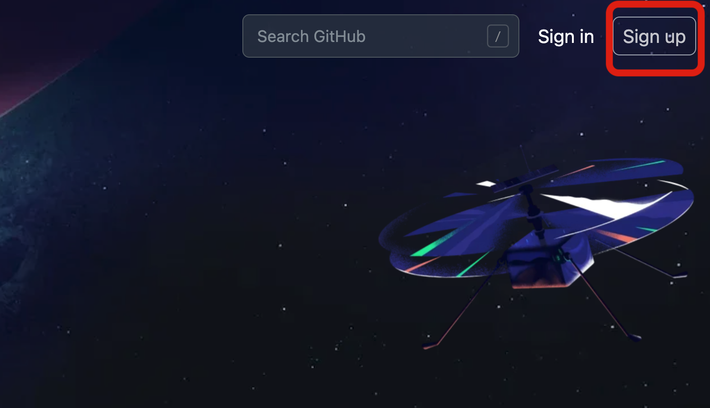
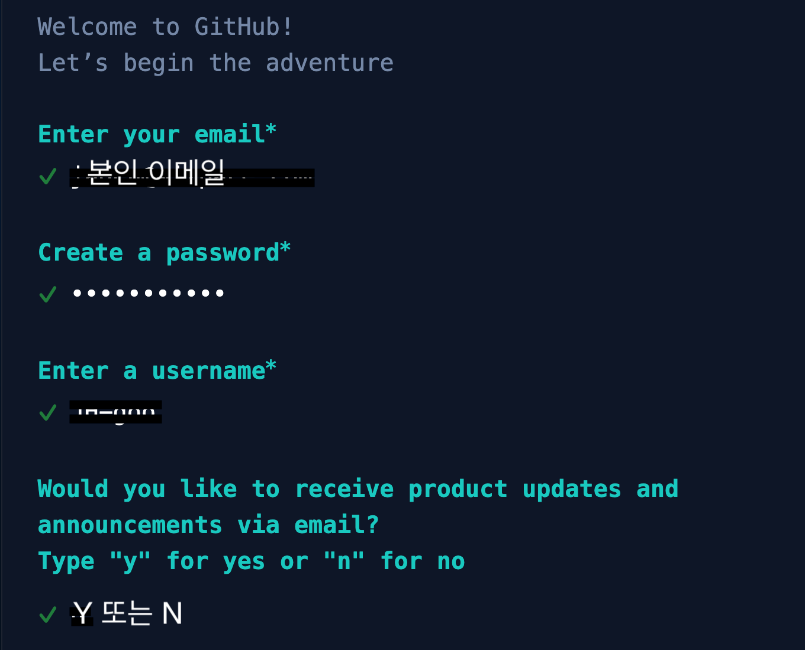
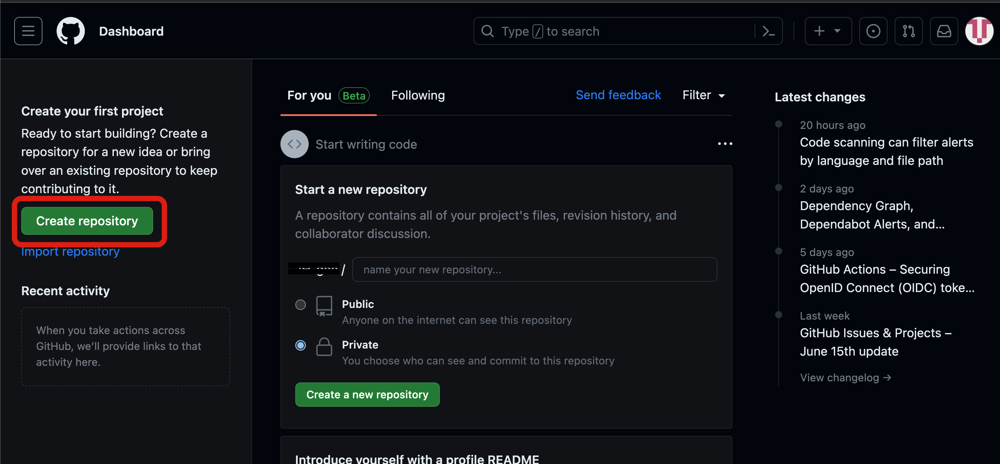
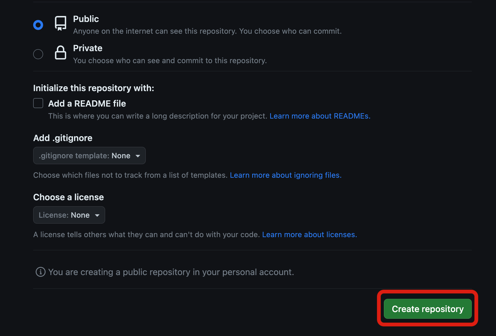

# [vuepress] 1_3. github에 모든 걸 맡겨보자

github은 만능이 아닙니다. 다만 좋은 대체제로 사용할 수 있습니다. 호스팅 서버를 대체할 용도로 우리는 github을 사용할 예정입니다.

대부분의 것들은 우리가 신경조차 쓸 필요가 없습니다.

무엇을 해야할지 알아 보겠습니다.

1. github 계정을 만든다
2. repository를 만든다
3. 코드를 올린다
4. github pages를 만든다.

이런 순서로 진행 될 것입니다. 다만 지금 당장 할 것은 github 계정을 만들고 repository를 생성까지만 진행할 것 입니다.

## github 계정 만들기

github은 메일 계정을 통해서 계정을 생성할 수 있습니다.

회원가입 창이 영문이고 다소 현대적으로 보인다고 걱정하지 마세요.

일반적으로 이메일 회원가입을 진행하는 것 같이 진행해 주시면 됩니다.

그 뒤 보이는 질문들은 굳이 성의껏 답변하실 필요는 없습니다. 그냥 `next` 버튼을 클릭하시면 됩니다.

::: warning
마지막에 `free` 모델로 선택하시면 됩니다. 우리가 사용하는 서비스 중 유료 모델을 사용할 일은 없습니다.
:::

이렇게 되면 자신의 깃헙 계정에 접속할 수 있습니다.

이제 계정을 만들었습니다. 다음으로 Repository를 생성해 보겠습니다.

## Repository 만들기

Repository는 구글 클라우드와 같이 인터넷에 가상 저장소라고 생각하시면 되겠습니다.

구글 클라우드에 평소 사진을 저장해 놓고 핸드폰에서 꺼내서 보거나 남들에게 링크를 통해 보내거나 할 수 있듯이 우리는 이 Repository에 코드를 올리고 남에게 공유하기도 하고 저장하기도 합니다.

이렇게 저장한 코드들이 우리들의 웹사이트로 변신하는 것을 우리는 볼 수 있을 겁니다.

그럼 Repository를 만들어 보겠습니다.

`create` 버튼을 누르고 원하는 이름 여기서 이름은 원하는 블로그 이름정도로 맞춰 주세요.(변경할 수 있습니다.)

::: tip
`public` 변경 해주시고, 나머지는 무시하시면 됩니다.
:::

이렇게 하면 새로운 repository를 만드셨습니다.

생각보다 간단하게 여기까지 도착하셨길 바랍니다.

이제 슬슬 본격적으로 코드를 만들어 올리고 웹 페이지로 만드는 과정이 남았는데요.

다음 챕터에서 만나겠습니다.
